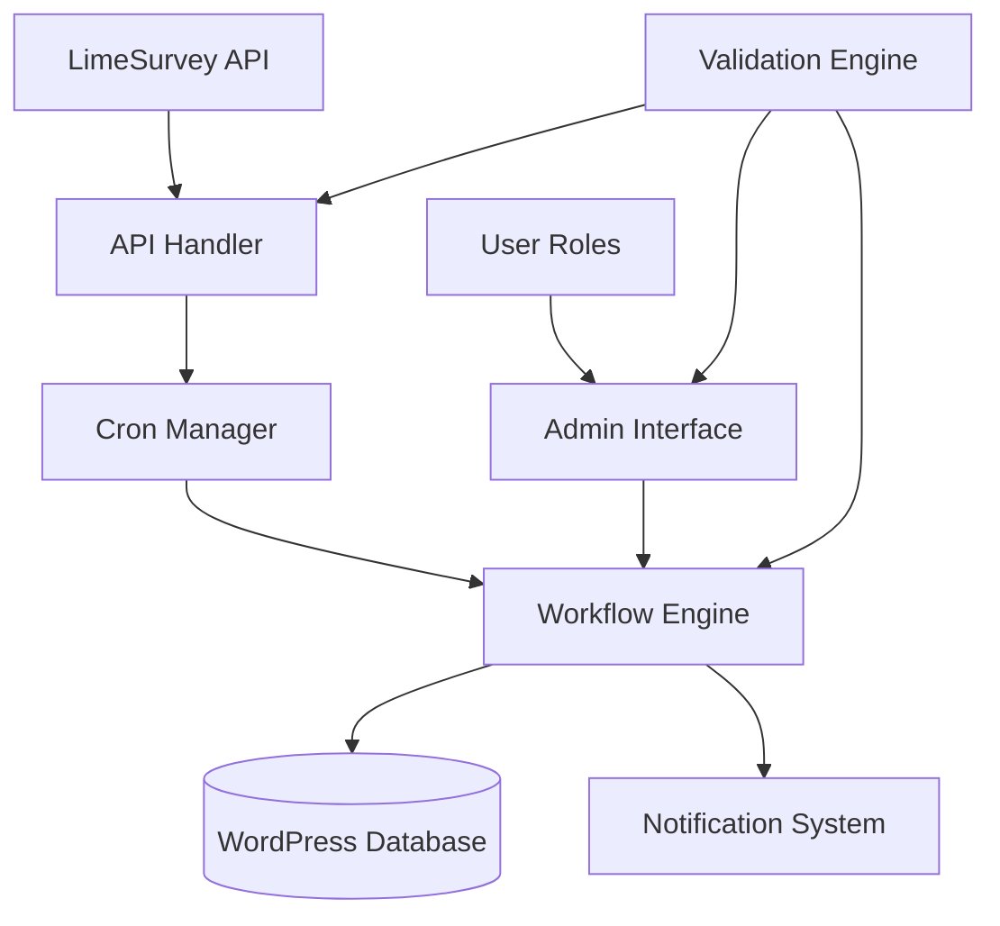
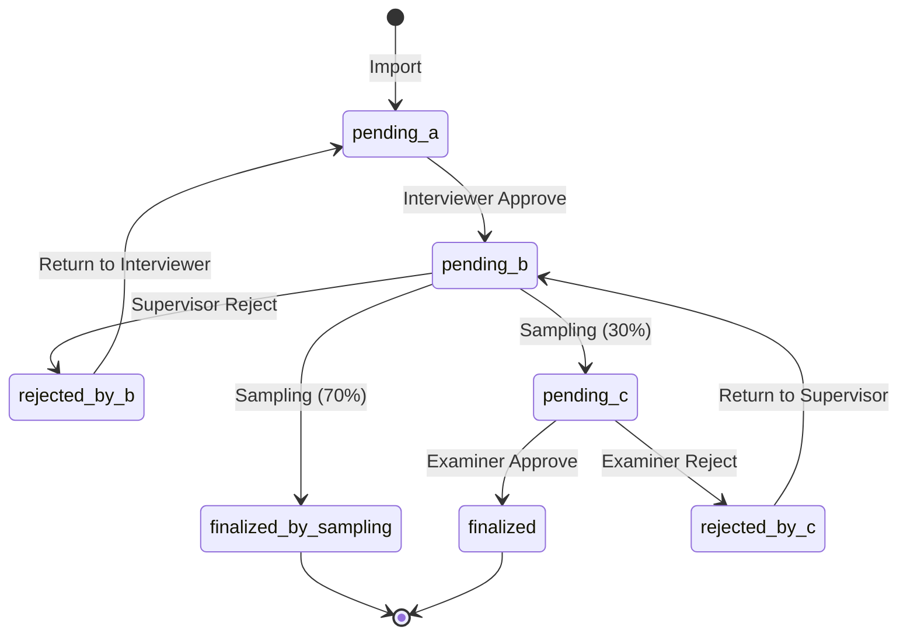

# Design Document

## Overview

The TPAK DQ System is a WordPress plugin that implements a comprehensive data quality management system for survey data. The system integrates with LimeSurvey API, manages a multi-role workflow process, and provides automated data import with validation. The architecture follows WordPress plugin best practices with a modular, object-oriented design.

## Architecture

### High-Level Architecture



### Plugin Structure

The plugin follows WordPress standards with the following directory structure:

```
tpak-dq-system/
├── tpak-dq-system.php          # Main plugin file
├── uninstall.php               # Cleanup script
├── includes/                   # Core classes
├── admin/                      # Admin interface
└── assets/                     # Static resources
```

### Database Schema

The plugin extends WordPress with custom post types and meta fields:

- **Custom Post Type**: `tpak_survey_data`
  - Stores individual survey responses
  - Uses post_status for workflow states
  - Meta fields for survey data and audit trail

- **WordPress Options**: 
  - `tpak_dq_settings` - API and system configuration
  - `tpak_dq_cron_settings` - Cron job configuration

## Components and Interfaces

### 1. Core Plugin Class (`TPAK_DQ_System`)

**Responsibilities:**
- Plugin initialization and lifecycle management
- Hook registration and dependency injection
- Component orchestration

**Key Methods:**
- `init()` - Initialize all components
- `activate()` - Plugin activation hooks
- `deactivate()` - Plugin deactivation hooks

### 2. API Handler (`TPAK_API_Handler`)

**Responsibilities:**
- LimeSurvey RemoteControl 2 API communication
- Data retrieval and transformation
- Connection validation and error handling

**Key Methods:**
- `connect()` - Establish API session
- `get_survey_data()` - Retrieve survey responses
- `validate_connection()` - Test API connectivity
- `transform_data()` - Convert API data to WordPress format

**Interface:**
```php
interface TPAK_API_Interface {
    public function connect($url, $username, $password);
    public function get_survey_data($survey_id, $last_import_date);
    public function validate_connection();
    public function disconnect();
}
```

### 3. Workflow Engine (`TPAK_Workflow`)

**Responsibilities:**
- Manage 3-step verification process
- Handle status transitions and business rules
- Implement sampling gate logic
- Audit trail management

**Key Methods:**
- `transition_status()` - Handle status changes
- `apply_sampling_gate()` - Implement 70/30 sampling logic
- `validate_transition()` - Check user permissions and business rules
- `log_action()` - Record audit trail

**State Machine:**


### 4. User Role Manager (`TPAK_Roles`)

**Responsibilities:**
- Create and manage custom user roles
- Define role capabilities and permissions
- Handle role-based access control

**Custom Roles:**
- `tpak_interviewer_a` - Can edit pending_a and rejected_by_b data
- `tpak_supervisor_b` - Can review pending_b data
- `tpak_examiner_c` - Can review pending_c data

**Capabilities:**
- `edit_tpak_data` - Edit survey data
- `review_tpak_data` - Review and approve data
- `manage_tpak_settings` - Access system settings

### 5. Cron Manager (`TPAK_Cron`)

**Responsibilities:**
- Schedule and execute automated data imports
- Manage cron job lifecycle
- Handle import failures and retries

**Key Methods:**
- `schedule_import()` - Set up recurring import job
- `execute_import()` - Perform data import
- `handle_import_failure()` - Error handling and logging

### 6. Notification System (`TPAK_Notifications`)

**Responsibilities:**
- Send email notifications for workflow events
- Template management for different notification types
- Notification preferences and settings

**Key Methods:**
- `send_assignment_notification()` - Notify user of new assignment
- `send_status_change_notification()` - Notify of status updates
- `get_notification_template()` - Load email templates

### 7. Validation Engine (`TPAK_Validator`)

**Responsibilities:**
- Comprehensive data validation across all system inputs
- Security validation and sanitization
- Business rule validation

**Validation Categories:**
- API Settings: URL, credentials, survey ID validation
- Survey Data: Structure and format validation
- User Input: Length, format, security validation
- Workflow Actions: Permission and state validation

### 8. Admin Interface Components

#### Settings Page (`TPAK_Admin_Settings`)
- API configuration interface
- Cron job settings
- Notification preferences
- System status display

#### Data Management (`TPAK_Admin_Data`)
- Data listing with role-based filtering
- Bulk actions for data management
- Import/export functionality

#### Meta Boxes (`TPAK_Meta_Boxes`)
- Survey data display and editing
- Workflow action buttons
- Audit trail display

## Data Models

### Survey Data Model

```php
class TPAK_Survey_Data {
    private $id;
    private $survey_id;
    private $response_id;
    private $data; // JSON encoded survey responses
    private $status; // Workflow status
    private $assigned_user;
    private $created_date;
    private $last_modified;
    private $audit_trail; // JSON encoded history
}
```

### Audit Trail Model

```php
class TPAK_Audit_Entry {
    private $timestamp;
    private $user_id;
    private $action; // status_change, data_edit, etc.
    private $old_value;
    private $new_value;
    private $notes;
}
```

## Error Handling

### Error Categories

1. **API Errors**
   - Connection failures
   - Authentication errors
   - Data format errors
   - Rate limiting

2. **Validation Errors**
   - Invalid input data
   - Business rule violations
   - Permission errors

3. **System Errors**
   - Database errors
   - File system errors
   - Memory/timeout issues

### Error Handling Strategy

- **Graceful Degradation**: System continues to function with reduced capability
- **User-Friendly Messages**: Clear, actionable error messages for users
- **Detailed Logging**: Comprehensive error logging for administrators
- **Automatic Recovery**: Retry mechanisms for transient failures

### Error Logging

```php
class TPAK_Logger {
    public function log_error($level, $message, $context = []);
    public function log_api_error($endpoint, $error, $request_data);
    public function log_validation_error($field, $value, $rule);
    public function log_workflow_error($action, $data_id, $user_id, $error);
}
```

## Testing Strategy

### Unit Testing
- Individual class and method testing
- Mock external dependencies (LimeSurvey API)
- Validation function testing
- Workflow logic testing

### Integration Testing
- API integration testing with LimeSurvey
- Database operation testing
- Email notification testing
- Cron job execution testing

### User Acceptance Testing
- Role-based access testing
- Workflow process testing
- UI/UX testing for all user roles
- Performance testing with large datasets

### Test Data Management
- Sample survey data fixtures
- User role test scenarios
- API response mocking
- Database state management

## Security Considerations

### Data Protection
- Input sanitization using WordPress functions
- SQL injection prevention with prepared statements
- XSS prevention with output escaping
- CSRF protection with nonces

### Access Control
- Role-based permissions enforcement
- Capability checking for all actions
- Session management and timeout
- Audit logging for security events

### API Security
- Secure credential storage
- API rate limiting handling
- SSL/TLS enforcement for API calls
- Error message sanitization

## Performance Considerations

### Database Optimization
- Proper indexing for query performance
- Efficient meta query structures
- Pagination for large datasets
- Query caching where appropriate

### Cron Job Optimization
- Batch processing for large imports
- Memory management for large datasets
- Timeout handling and resumption
- Error recovery and retry logic

### Frontend Performance
- Minimal JavaScript and CSS loading
- AJAX for dynamic content updates
- Efficient data table rendering
- Progressive loading for large lists

## Scalability Design

### Data Volume Handling
- Efficient pagination and filtering
- Archive/cleanup strategies for old data
- Database partitioning considerations
- Memory-efficient data processing

### User Load Management
- Role-based data filtering
- Efficient permission checking
- Caching strategies for repeated queries
- Optimized admin interface queries

### API Rate Limiting
- Respectful API usage patterns
- Exponential backoff for failures
- Queue management for high-volume imports
- Monitoring and alerting for API issues